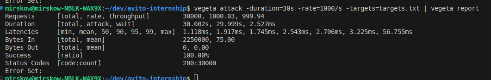

# REST API Для Создания Merch Shop на Go

Проект для обмена монетами между пользователями и приобретения мерча.  
Реализован на **Go**, использует **PostgreSQL** и запускается в контейнерах через **Docker Compose**.

## Сборка и запуск
### Зависимости
- Go 1.23
- PostgreSQL 16.0
- Docker & Docker-compose
- [golangci-lint](https://github.com/golangci/golangci-lint)

### Для запуска приложения:
1. Создайте файл .env в корневом каталоге и добавьте следующие значения:
```dotenv
DB_USER=admin  # Имя пользователя БД
DB_PASSWORD=secret  # Пароль для подключения
DB_NAME=merch_shop  # Название базы данных
DB_PORT=5432  # Порт PostgreSQL

JWT_SECRET=your_jwt_secret  # Секрет для подписания JWT
PASSWORD_SALT=random_salt  # Соль для хэширования паролей

DB_PASSWORD_TEST=testpassword # Пароль для тестовой базы данных в контейнере

```

2. Используйте следующие команды для сборки и запуска проекта:
```
make build && make run
```
После этого сервис будет доступен на порту `:8080`.

3. Перед первым запуском необходимо выполнить миграции базы данных со значениями параметров как в файле .env:
```
make migrate DB_USER='' DB_PASSWORD='' DB_NAME=''
```
4. Для проверки кода можно использовать линтер:
```
make lint
```
5. Unit-тесты запускаются командой:
```
make test
```
6. Интеграционные тесты запускаются командой:
```
make test.integration
```

### Нагрузочное тестирование проекта

Тестирование проводилось при помощи утилиты vegeta со следующими параметрами:
```
vegeta attack -duration=30s -rate=1000/s -targets=targets.txt | vegeta report
```

Результаты нагрузочного тестирования представлены на снимке.

# merch-shop
